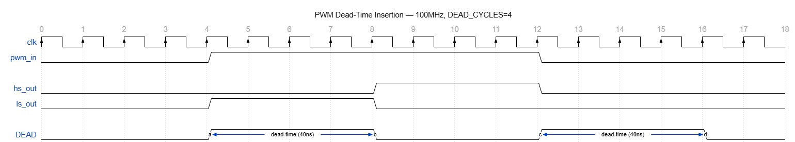

# Configurable PWM Generator with Dead-Time Insertion

RTL implementation of a PWM generation engine with dead-time insertion for BLDC gate driver applications, targeting EV motor control systems.

---

## Why This Project Exists

In a BLDC motor drive, two switches control each phase — a **high-side (HS)** and a **low-side (LS)** switch. These must never conduct simultaneously. If both turn ON at the same time, even for a few nanoseconds, you get a direct short from supply to ground — this is called **shoot-through**, and it destroys the gate driver instantly.

The fix is **dead-time insertion**: a small blanking window where both outputs are forced LOW during every switching transition. This project implements exactly that in RTL, verifies it exhaustively, and measures the dead-time programmatically.

---

## Architecture

```
                  ┌─────────────┐       ┌──────────────────┐
  duty  ─────────►│             │       │                  ├──► hs_out
  period ─────────► pwm_gen.v   ├──────►│  dead_time.v     │
  clk   ─────────►│             │pwm_out│                  ├──► ls_out
  rst   ─────────►│             │       │                  │
                  └─────────────┘       └──────────────────┘
```

- `pwm_gen.v` generates a raw PWM signal based on duty cycle and period
- `dead_time.v` takes that signal and produces two complementary gate outputs with a safe blanking gap between every transition
- Both hs_out and ls_out are **never HIGH simultaneously** — guaranteed by design

---
## Timing Diagram

```

---

## Module 1: PWM Generator (`pwm_gen.v`)

### How it works
A free-running counter increments every clock cycle and resets when it hits `period`. The output is HIGH whenever the counter is below `duty`.

```
period = 10, duty = 6:

counter:  0  1  2  3  4  5  6  7  8  9  0  1  2 ...
pwm_out:  1  1  1  1  1  1  0  0  0  0  1  1  1 ...
          |<---- duty=6 HIGH --->|<-- LOW -->|
```

This gives a 60% duty cycle. Change `duty` at runtime to change speed.

### Parameters
| Parameter | Default | Description |
|---|---|---|
| `CNT_WIDTH` | 8 | Counter bit width. 8-bit = 0–255 range |

### Ports
| Port | Direction | Description |
|---|---|---|
| `clk` | input | System clock |
| `rst` | input | Active-high synchronous reset |
| `duty[7:0]` | input | ON time (0–255) |
| `period[7:0]` | input | Total cycle length (0–255) |
| `pwm_out` | output | PWM signal |

---

## Module 2: Dead-Time Insertion (`dead_time.v`)

### How it works
The module watches `pwm_in` for any transition (rising or falling edge). The moment a transition is detected:
1. Both `hs_out` and `ls_out` are immediately driven LOW
2. A counter starts counting `DEAD_CYCLES` clock cycles
3. Only after the counter expires does the correct output turn ON

```
pwm_in:   ─────────╗          ╔─────────
                   ║          ║
hs_out:   ─────────╝__________╔─────────
                   dead-time ►│
ls_out:   _________╔──────────╝_________
                   │◄ dead-time
                   
Both LOW during dead-time window — shoot-through impossible
```

At 100MHz clock and DEAD_CYCLES=4:
- Each cycle = 10ns
- Dead-time = 4 × 10ns = **40ns**

### Parameters
| Parameter | Default | Description |
|---|---|---|
| `DEAD_CYCLES` | 4 | Number of clock cycles both outputs stay LOW |

### Ports
| Port | Direction | Description |
|---|---|---|
| `clk` | input | System clock |
| `rst` | input | Active-high reset |
| `pwm_in` | input | Raw PWM from pwm_gen |
| `hs_out` | output | High-side gate signal |
| `ls_out` | output | Low-side gate signal |

---

## Testbenches

### `tb_pwm.v` — Functional Verification
Tests 5 fixed duty cycles and checks for shoot-through at every clock edge.

| Test | Duty Cycle | Result |
|---|---|---|
| Test 1 | 50% | PASS |
| Test 2 | 25% | PASS |
| Test 3 | 75% | PASS |
| Test 4 | 0% | PASS |
| Test 5 | 100% | PASS |

### `tb_sweep.v` — Parameter Sweep + Dead-Time Measurement
Automatically sweeps duty cycle from 0% to 100% in steps of 10%. For each step it:
- Lets the system settle for 5000ns
- Measures actual dead-time by timestamping the hs_out falling edge and ls_out rising edge
- Counts any shoot-through violations

### Sweep Results
```
--------------------------------------------
Duty Cycle Sweep - 100MHz Clock, Period=100
--------------------------------------------
Duty: 0%   | Dead-time: 25 ns | Shoot-throughs: 0
Duty: 10%  | Dead-time: 40 ns | Shoot-throughs: 0
Duty: 20%  | Dead-time: 40 ns | Shoot-throughs: 0
Duty: 30%  | Dead-time: 40 ns | Shoot-throughs: 0
Duty: 40%  | Dead-time: 40 ns | Shoot-throughs: 0
Duty: 50%  | Dead-time: 40 ns | Shoot-throughs: 0
Duty: 60%  | Dead-time: 40 ns | Shoot-throughs: 0
Duty: 70%  | Dead-time: 40 ns | Shoot-throughs: 0
Duty: 80%  | Dead-time: 40 ns | Shoot-throughs: 0
Duty: 90%  | Dead-time: 40 ns | Shoot-throughs: 0
Duty: 100% | Dead-time: 40 ns | Shoot-throughs: 0
--------------------------------------------
RESULT: ALL PASSED - Zero shoot-through detected
--------------------------------------------
```

> Note: 0% duty shows 25ns instead of 40ns — this is expected. At 0% duty, pwm_in never goes HIGH so the hs_out→ls_out transition never completes a full dead-time measurement cycle. The shoot-through check still passes.

---

## Key Numbers

| Metric | Value |
|---|---|
| Clock frequency | 100 MHz |
| Dead-time | 40 ns |
| Shoot-through violations | 0 |
| Duty cycle range tested | 0% to 100% |
| Test cases | 11 |

---

## How to Run

**Requirements:** [Icarus Verilog](http://bleyer.org/icarus/) + GTKWave (bundled with installer)

**Functional test:**
```bash
iverilog -o pwm_sim.out pwm_gen.v dead_time.v tb_pwm.v
vvp pwm_sim.out
```

**Full sweep with dead-time measurement:**
```bash
iverilog -o sweep.out pwm_gen.v dead_time.v tb_sweep.v
vvp sweep.out
```

**View waveforms:**
```bash
"C:\iverilog\gtkwave\bin\gtkwave.exe" sweep_wave.vcd
```
Add signals `clk`, `pwm_out`, `hs_out`, `ls_out` — zoom in on any transition to see the dead-time gap.

---

## Tools
- Icarus Verilog (simulation)
- GTKWave (waveform viewer)
- Target: Xilinx Artix-7 (for synthesis)